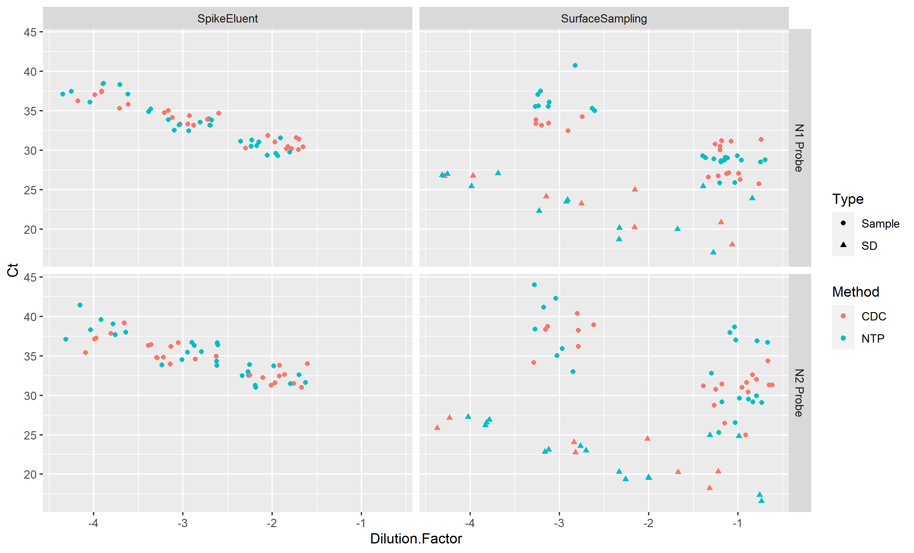
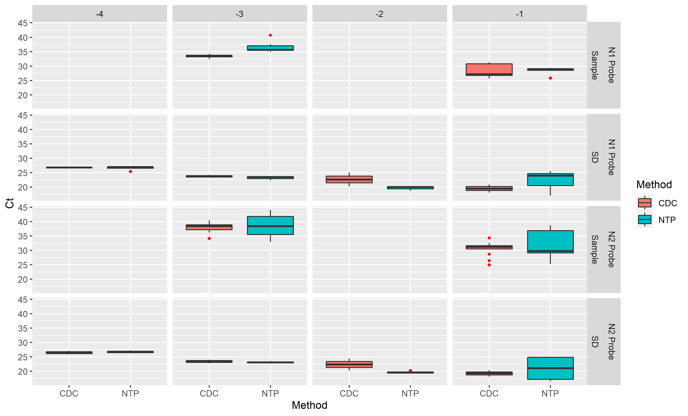

# Data Exploration
Complete the data loading/cleaning/wrangling part, as well as having a mostly complete data exploration part.  

## Data Loading  
_What the data is_  

Compilation of RT-PCR results for a couple of probes (N1 & N2) to detect recovered heat-inactivated SARS-CoV-2 samples that have undergone sample enhancement procedures.
These data can be found in the data folder under raw_data

## Data Cleaning
Cleaned data is found under the data in processed_data folder

1. Compiled reports into a single csv.
2. Import the reports into R.
3. Check summary, head, and tail of data 
4. Select relevant parts of the data to form new data frame
5. Mutate classes of data for easier manipulation.
6. Renamed a value as it is the only value left. The Raw data had sevearl versions of it as the series of columns displayed a train of thought display of calculation.

* noted that there were additional NAs that would be generated when mutating Ct values into numeric. Which should be fine, but with how the reports are generated some levels recorded are noted as Undetermined or not reliably detected.
* Decide to Split the Data and make a companion UndeterminedData dataframe for additional analysis.

__Making the UndeterminedData__
see above but added filter() for Ct=="Undetermined" to pull all data with Undetermined as a reported value

## Data Wrangling

Started to play with analysisscript.
Outputs of the data play are in results.

####Run summaries

####Exploritory Figures

##### View the whole data set

##### Breakdown comparisons with the two methods being compared-- CDC and NTP had a comparitive input of 300uL

Interesting-- why is there such a group difference in Surface Sampling experiements versus Spike
Oh makes sense it's SD- the serial dilution. We expect the SD to be like the standard curve and the recovery should have loss.

Deeper dive into looking at the Surface Sampling Experiment, as it has some differences and is new-er data. Also includes data with Temp & RH:

##### Breakdown comparisons more with only the Surface Sample experiment

