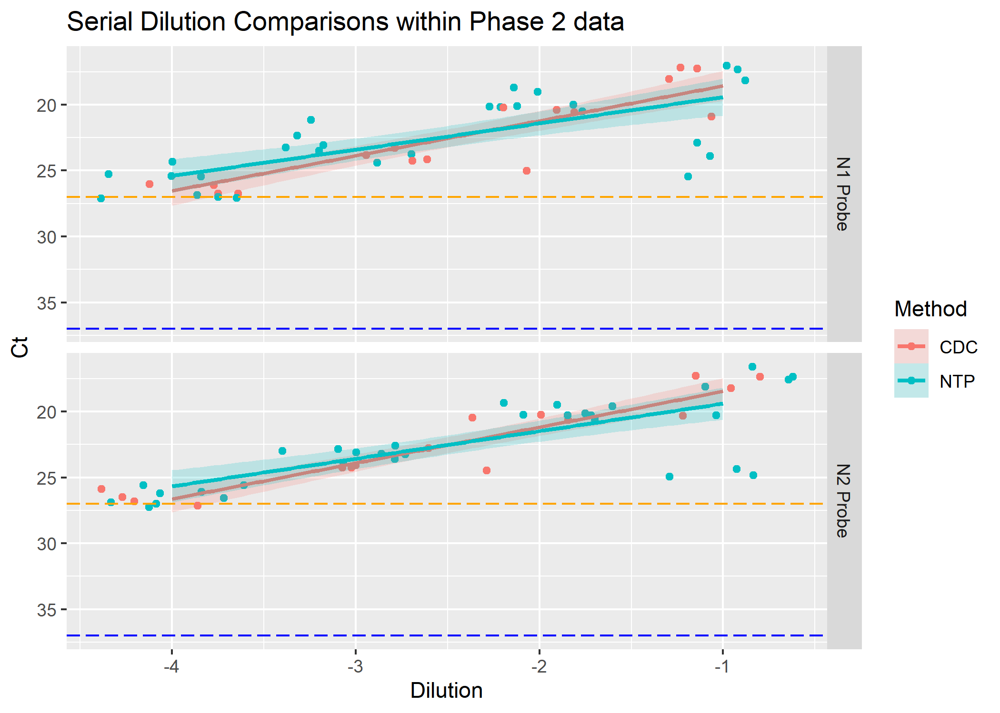

# Summary/Abstract

The global Coronavirus Disease 2019 (COVID-19) pandemic continues to persist due to the timing of an available vaccine, varying adherence to COVID-19 public health safety recommendations, and the emergence of SARS-CoV-2 (SC2) variants. Environmental reservoirs are a reported, indirect transmission route for viral pathogens. Although many viruses have a low infectious dose, they can be difficult to detect due to the low-bioburden in the environment. The ability to detect viral pathogens is critical to identifying hidden reservoirs which can inform infection control. Culture-based methods can be labor and time intensive. The use and limitations of commercial “target capture” (TC) technologies are varied compared to molecular approaches utilizing automated extraction. The objective of this study is improved outbreak response through rapid pathogen detection by evaluating a TC technology’s ability to capture SC2 from complex matrices. That data gathered supports that the using TC technology, nanoparticles, does extract from a sample, yet shows no difference between the currently used automated extraction method. Comparisons between the details of method used were also explored. Sample factors such as input and dilution were found to impact sample recovery and environmental data showed very light effects-- as shown by using machine learning methods. 

<br><br>

# Introduction

The global Coronavirus Disease 2019 (COVID-19) pandemic continues to persist due to the timing of an available vaccine, varying adherence to COVID-19 public health safety recommendations, and the emergence of SARS-CoV-2 (SC2) variants. Environmental reservoirs are a reported, indirect transmission route for viral pathogens [@Tanner2021;@Marcenac2021-sz]. Although many viruses have a low infectious dose, they can be difficult to detect due to the low bio-burden in the environment. The ability to detect viral pathogens is critical to identifying hidden reservoirs which can inform infection control [@Paton2021-jc]. Culture-based methods can be labor and time intensive. The use and limitations of commercial "target capture" (TC) technologies are varied compared to molecular approaches utilizing automated extraction. The objective of this study is improve outbreak response through rapid pathogen detection by evaluating a TC technology's ability to capture SC2 from complex matrices.

The virus is capable of human-to-human transmission via inhalation of infected aerosols. To limit the effect, patients with COVID-19 symptoms have been encouraged to test for a confirmed diagnosis one such test that has been the accepted standard is the SARS-coV-2 real-time RT-PCR reverse transcription–polymerase chain reaction (RT-PCR)[@Hanson2020]. However, like with many tests, RT-PCR are subject to error and can produce false negative results.

This Previous evaluations of viral fragment longevity have tested negative and indicate the possibility of no present virus or below assay limit of detection [@Parker2020].

CT quantification has been shown to have potential for assisting in decision-making in the management of COVID-19 patients[@Hanson2020]. CT quantification combined with patient symptom data has shown promise when implemented with machine learning, although many studies are focused on patient information or are proof of concept [@Cai2020;@Langer2020;@Gangloff2021].

The promise of these evaluations may translate well into environmental sampling and surveillance allowing for preventive action in regards to reducing risk and containing outbreak.
<br>

# Material and methods

## Data collection


### Setup and conditions

Using established standard methods for environmental sampling with a self-contained polyurethane swab from stainless steel surface, a TC approach (NTP; Nanotrap® Magnetic Virus Particles, Ceres Nanosciences) was compared to an automated extraction method (MX48; Maxwell® RSC Viral Total Nucleic Acid Purification Kit, Promega) for recovery of heat-inactivated SC2 from the polyurethane swab as detected by rRT-PCR. [@Wittwer2012-vt;@Shah2021-mb;@Barclay2020].
Real time RT-PCR was conducted per CDC 2019-nCoV Real-Time RT-PCR Diagnostic Panel protocol to detect the presence of N1 and N2 sequences designed for the specific detection of 2019-nCoV.Reports were QCed and exported from machines electronically.

### Data aquisition and compillation

Summary data was selected from the reports and added to additional environmental data gathered on based on the extraction date of the sample.

A composted data set was compiled and saved as a csv to be used as the base data for the project along with environmental condition data from a specific recovery experiment.

## Data cleaning

Data was cleaned and reformatted to relevant factors and numeric data types.
During cleaning the data was split and saved in three forms- All (compilation of all recovery studies- P1 and P2);P1 (only data from spiked studies); and P2 (only data from surface sampling studies).
P1 and P2 were analyzed together due to constant serial dilution controls.
P2 data were expanded on due to the interests of the study focusing on surface recovery. 

## Analysis

Analysis was tailored to three major aims of this study:

1.  Do the sample enhancement strategies work?
2.  How well do they work compared to each other?
3.  Are there any environmental variables recorded that have a positive impact on detection?

To evaluate Aim 1, All data was utilized to compare Methods and their respective Ct values per serial dilution factor. A serial dilution series was utilized across all assays to insure consistencies regardless of study.

For Aim 2, data was limited to P2 data from this point onwards to focus on surface recovery of genomic material and limit variability from P1 spiked studies. An exploration in how Tool and Methods differed. Additional exploration occured in looking specifically at the NTP Method and its results as there were additional variables in input.

Final in Aim 3, we implemented several machine learning techniques to determine if it is possible to model Ct recovery with the data gathered and what variables impact the recovered Ct value. We utilized the random forest model to see what all factors and their impact and repeated with more specific asks in the model. Then we use the best fit tree model to make a decision tree on predictability of recovered Ct Values.    

# Results

## Aim 1: Does NTP work?

We compare Ct values of the serial dilution controls from all studies between CDC and NTP methods.

```{r ALL-SD, fig.cap="Serial Dilution Comparisons within Phase 2 data", echo=FALSE}
knitr::include_graphics("../../results/ALL-SD-Plot.png")
```

Serial dilution Ct values increase in a linear manner and within expected intervals indicating log10 loss as the dilution value decreases. Overall the Methods appear to not be too different from one another at higher dilution levels, but we also see that as the Dilution level decreases the the NTP method registers a lower Ct value than the CDC method and begins to differentiate.

## Aim 2: How much more different - Phase 2 Focused Exploration

```{r P2-SD, fig.cap="Serial Dilution Comparisons within Phase 2 data", echo=FALSE}

```

Repeat comparisons of the first Aim but with the data from P2 to see if the differences are evident. Overall the Methods appear to not be explicitly different from one another. The divergence of CDC and NTP methods is still seen slightly with CDC recovering less at higher dilution levels and switching places with NTP as the dilution increases.

### Phase 2 Comparing A and B Tool Recovery

```{r P2-Tool-AB, echo=FALSE, fig.cap="Phase 2 Comparison of A and B tool recovery at different input volumes by Probe"}
knitr::include_graphics("../../results/ASK-P2P1-Tools.png")
```

The larger the input volume the recovered Ct values tends to be smaller. 
Tool A has an average Ct recovery higher than B. This makes sense as the surfaces A recovered from is 2 logs higher (-1) than that of B (-3). A log drop is ~3Ct values we can see from the graphic that it trends as predicted. 
Between methods at an input level of 300ul, there's a lot more variability in the NTP method than the CDC method,.
Probes see little to no difference in Ct Values recovered.

### Phase 2 Comparing Methods with standard input of 300uL

```{r P2Tools-Method, fig.cap="P2 Direct Comparisons of Recovery by Methods used", echo=FALSE}
knitr::include_graphics("../../results/ASK-P2P3-Methods0300.png")
```

Serial dilution data between CDC and NTP. Noting that all SD are in the confirmed realm of under 27 Ct Value CDC method is better than NTP at -1 concentration of the SD. the -2 shows little difference between method recovery Ct values. NTP appears to remain better than CDC at -3 and -4 levels. Accounting for the SE looks like both methods are the same until the -2 dilution. Might be significant difference at the -4 dilution.

### Phase 2 Nanoparticles only - All tools at 300 and 1000ul input levels

```{r echo=FALSE}
knitr::include_graphics("../../results/ASK-P2P6-NTP.png")
```

A closer look at specially NTP only results with the CDC input vol and the max vol the manufacturer recommends. The increased input volume appears to result in smaller recovery values than the smaller input volume. Still no difference between Probe types.

## Data Modeling

To determine if other variables affect the recovery Ct values.

```{r ImportanceFactor, fig.cap="Random forest modeled Importance Factor- all variables",echo=FALSE}
knitr::include_graphics("../../results/P2-RF-BestFit.png")
```

Random forest model comparing Ct values and all other factors in terms of importance of affects. Top three are all tools. Method and Detector are the least important factors affecting Ct values.

```{r ImportanceFactor2, fig.cap="Bootstrapped Importance Factor excluding Tools", echo=FALSE}

```

Limited comparison specifically for Dilution and Input. Additionally put in Method to see if there are any affects. Dilution plays a larger importance than the input of genomic material in this assay for recoverable Ct values. No real importance between method, in fact, negative importance with NTP.


```{r minusDecisionTree, fig.cap="Bootstrapped Decision Tree of Limited Factors.", echo=FALSE}

```

Ran the Random Forest parameters as a best tree to create a decision tree. We can see that Dilution can be exclusively what determines recovery values when dilutions are less than -1.5. If dilutions are above -1.5, the input of sample and method may influence the recovered Ct values.

# Discussion

With the linear regression comparison in \@ref(fig:ALL-SD) we see a general trend of increasing Ct value as dilution decreases. Interesting to note that within \@ref(fig:ALL-SD) we see a larger divide between methods at the lower dilution level in figure \@ref(fig:P2-SD) as well. This suggests that NTP may perform better or be  able to capture the little genomic fragments in a low burdened sample and thus have some targeted/ concentrating abilities.

In a direct comparison between methods, NTP is more variable than CDC. This can be explained by the fact that each NTP sample is individually prepared and is subject to more variation in this action than compared to a machine. It is possible to automate the use of the NTP method, doing so may yield less variable values. 

Dilution and input play an important part in Ct recovery (\@ref(fig:ImportanceFactor) and \@ref(fig:ImportanceFactor2)). 
Tools A and B are different dilution levels (1:10 and 1:1000, respectively) and the drop between Ct values is consistent with expected log loss equivalent values (\@ref(fig:P2-Tool-AB)). In \@ref(fig:P2-Tool-AB) we can see that as the input increases the general sample has a smaller recovery Ct value. Yet, with the data gathered only after the input is greater than 6800uL does the value surpass the recovery range obtained at the 1000ul input volume. This suggests that the NTP method is able to utilize and capture at least what is available in the sample, and perhaps more.


## Limitations

The use of dilution in this study is limiting as we can only estimate the genomic copies that are being picked up by the real time RT-PCR assay. Additional studies or re-count of the samples by use of digital droplet PCR to get an estimate count of genomic copies would yield better association and capture comparison data.

RT-PCR does not distinguish between infectious and non-infectious virus. Additional work will need to be completed to better compare the recovery and estimate the true risk of SC2 in the environment.

Need more replicates, but this is a time consuming processes just to get the data.

Additional materials need to be considered [@Jansson2020-cg].
Previous studies have demonstrated capture techniques can overcome limitations of conventional studies, and if applied to environmental samples can yield better data to enlighten the field [@Gasc2018].

## Conclusions

The use of NTP does result in the recovery of Ct values in the assay.
with the results of the analysis of data there is no significant difference between the automated extraction method and the NTP
Using some ML modeling we can see that there are some recorded variables that affect the Ct values- Dilution of the sample and Input.

# Data accessibility

Data and code required to complete the analysis are available from `MONICACHAN-MADA-project` Repository.

# References
