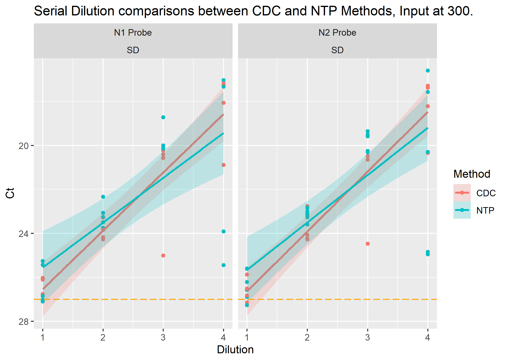
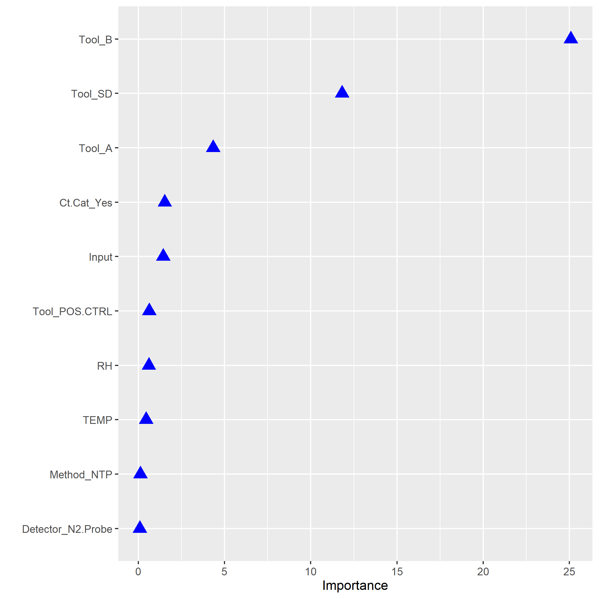

# Summary/Abstract

The global Coronavirus Disease 2019 (COVID-19) pandemic continues to persist due to the timing of an available vaccine, varying adherence to COVID-19 public health safety recommendations, and the emergence of SARS-CoV-2 (SC2) variants. Environmental reservoirs are a reported, indirect transmission route for viral pathogens. Although many viruses have a low infectious dose, they can be difficult to detect due to the low-bioburden in the environment. The ability to detect viral pathogens is critical to identifying hidden reservoirs which can inform infection control. Culture-based methods can be labor and time intensive. The use and limitations of commercial “target capture” (TC) technologies are varied compared to molecular approaches utilizing automated extraction. The objective of this study is improved outbreak response through rapid pathogen detection by evaluating a TC technology’s ability to capture SC2 from complex matrices.

# Introduction

## Background

The global emergence of novel human coronavirus, SARS-CoV-2 (SC2) in 2019 became a global health concern. SC2 causes severe respiratory tract infections in humans with still unknown future complications. With the virus' high infection rate and rapid spreading capabilities via human-to-human transmission 

The global Coronavirus Disease 2019 (COVID-19) pandemic continues to persist due to the timing of an available vaccine, varying adherence to COVID-19 public health safety recommendations, and the emergence of SARS-CoV-2 (SC2) variants. Environmental reservoirs are a reported, indirect transmission route for viral pathogens [@Tanner2021;@Marcenac2021-sz]. Although many viruses have a low infectious dose, they can be difficult to detect due to the low bio-burden in the environment. The ability to detect viral pathogens is critical to identifying hidden reservoirs which can inform infection control [@Paton2021-jc]. Culture-based methods can be labor and time intensive. The use and limitations of commercial "target capture" (TC) technologies are varied compared to molecular approaches utilizing automated extraction. The objective of this study is improve outbreak response through rapid pathogen detection by evaluating a TC technology's ability to capture SC2 from complex matrices.

The virus is capable of human-to-human transmission via inhalation of infected aerosols. Previous evaluations of viral fragment longevity have tested negative and indicate the possibility of no present virus or below assay limit of detection [@Parker2020].
### Questions/Hypotheses to be addressed

There are several major aims of this:

1.  Do the sample enhancement strategies work?
2.  How well do they work compared to each other?
3.  Are there any environmental variables recorded that have a positive impact on detection?
4.  Can this data be modeled to back calculate a sample's original concentration based on the Ct values recovered?

Testing several sample enhancement strategies (Nanoparticles and Bait & Capture) for molecular detection of heat-inactivated SARS-CoV-2 from stainless-steel surfaces. The primary aim of this work is to determine if any of the enhancement strategies increase the concentration of RNA copies in a sample that will express itself as a lower Ct value from the Rt-PCR output. Lower Ct values equate to more copies being present in the sample meaning less time needed to confirm presence.

In the case the sample enhancements work, we would then compare how well they worked against an automated extraction method. The degree of "wellness" will be determined by how low the Ct value results are produced after a sample has going through a specific method.

In addition to the comparison of enhancement strategies the effects of the tool used for sampling (macrofoam or knit-fiber), time held, and other environmental variables will be explored any significant effects, with interest in positive impacts to detection [@Jansson2020-cg].

## Methods and Results

### Experiment setup and conditions

Using established standard methods for environmental sampling with a self-contained polyurethane swab from stainless steel surface, a TC approach (NTP; Nanotrap® Magnetic Virus Particles, Ceres Nanosciences) was compared to an automated extraction method (MX48; Maxwell® RSC Viral Total Nucleic Acid Purification Kit, Promega) for recovery of heat-inactivated SC2 from the polyurethane swab as detected by rRT-PCR [@Wittwer2012-vt;@Shah2021-mb;@Barclay2020].

## Data aquisition

Reports per each rRT-PCR run were generated and quality checked on their respective machines before transfer to a Teams repository. Summary data was selected from the reports and added to additional environmental data gathered on based on the extraction date of the sample.

Completed run data is then collated into one file and read into R./A composited data set was compiled and saved as a csv and used as the base data for the project

### Data import and cleaning

`processing script.R` was modified to do initial cleaning and preparation of the data set for further exploration.

Data was imported and cleaned. Data was then split between the two different experimental types (P1 and P2).

This can be found in `processing_code` folder in repository that generate rds files located in the `data/processed_data` folder.

### Data exploration

Processed data 

#### All Data

Overview - split between part 1 and part 2

##### Serial Dilutions confirmation

Summary table scatter plot of SDs based on dilution factors

```{r}
knitr::include_graphics("../../results/ALL-SD-Plot.png")
```

#### Phase 1

```{r}
knitr::include_graphics("../../results/P1-SD-Plot.png")
```

### Phase 2

```{r P2-SD, fig.cap="Serial Dilution Comparisons within Phase 2 data", echo=FALSE}
knitr::include_graphics("../../results/P2-SD-Plot.png")
```

#### Phase 2 Comparing A and B Tool Recovery

```{r P2-Tool-AB, echo=FALSE, fig.cap="Phase 2 Comparison of A and B tool recovery"}
knitr::include_graphics("../../results/ASK-P2P1-Tools.png")
```

Tool A has an average Ct recovery higher than B. This makes sense as the surfaces A recovered from is 2 logs higher (-1) than that of B (-3). A log drop is \~3Ct values we can see from the graphic that it trends as predicted. Suggests that
```{r P2-Tool-AB-Sum, eval=FALSE, fig.cap="Phase", include=FALSE}
knitr::kable(table, caption= "Example Table Caption", digits=2, col.names = )
```


#### Phase 2 Comparing Method Serial Dilutions (CDC vs NTP) with standard input of 300uL
MOVE TO SUPPLEMENT
```{r}

```

Serial dilution data between CDC and NTP. Noting that all SD are in the confirmed realm of under 27 Ct Value CDC method is better than NTP at -1 concentration of the SD. the -2 shows little difference between method recovery Ct values. NTP appears to remain better than CDC at -3 and -4 levels. Accounting for the SE looks like both methods are the same until the -2 dilution. Might be significant difference at the -4 dilution.

#### Phase 2 Comparing Methods with standard input of 300uL

```{r P2Tools-Method, fig.cap="P2 Direct Comparisons of Recovery by Methods used", echo=FALSE}

```

### Phase 2

Data was limited to Phase 2 data from this point on wards to limit variability in the surface recovery 

#### Phase 2 Method extraction comparisons with all inputs and tools


#### Phase 2 Nanoparticles only - Compare detectors with dilution and input in Serial Dilutions


#### Phase 2 Nanoparticles only - All tools at 300 and 1000ul input levels

```{r echo=FALSE}
knitr::include_graphics("../../results/ASK-P2P6-NTP.png")
```

### Data Analysis

### Data Modeling
```{r echo=FALSE}

```

```{r ImportanceFactor, fig.cap="Bootstrapped Importance Factor excluding Tools ", echo=FALSE}
knitr::include_graphics("../../results/P2-RF-BestFit-minus1.png")
```

```{r minusDecisionTree, fig.cap="Bootstrapped Decision Tree of Limited Factors.", echo=FALSE}
knitr::include_graphics("../../results/P2-DecisionTree-minus1.png")
```


## Exploratory analysis

Table \@ref(tab:summarytable) shows a table summarizing the data.

Figure \@ref(fig:minusDecisionTree) shows a bootstrapped decision tree figure.

```{r resultfigure, eval=FALSE, fig.cap='Analysis figure.', include=FALSE}

```

## Full analysis

Example table \@ref(tab:resulttable) shows a table summarizing a linear model fit.

# Discussion

## Summary and Interpretation

Took

## Strengths and Limitations
RT-PCR does not distinguish between infectious and non-infectious virus. Additional work will need to be completed to better compare the recovery and estimate the true risk of SC2 in the environment.
Need more replicates, but this is a time consuming processes just to get the data.

Additional materials need to be considered [@Jansson2020-cg].
Previous studies have demonstrated capture techniques can overcome limitations of conventional studies, and if applied to environmental samples can yield better data to enlighten the field [@Gasc2018].
## Conclusions
The use of nanoparticles does result in the recovery of Ct values in the assay.
with the results of the analysis of data there is no significant difference between the automated extraction method and the nanoparticles.
Using some ML modeling we can see that there are some recorded variables that affect the Ct values- Dilution of the sample and Input.

# References
